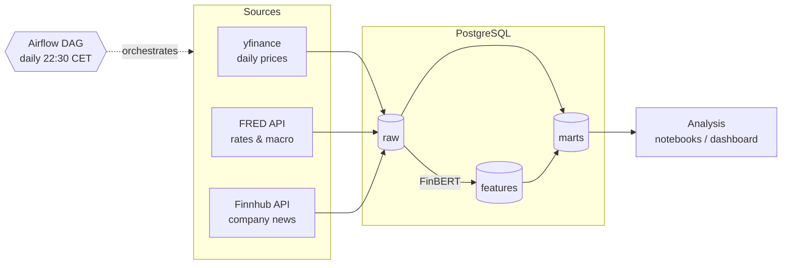

# Sentiment, Interest Rates & Stock Prices – Data Pipeline

End-to-end data pipeline that collects interest rates, macro indicators, stock prices and company news every day, scores news sentiment with a financial language model (FinBERT), and builds a daily feature table for measuring **how much each factor actually moves stock prices**.


## Architecture



The Airflow DAG runs every day after the US market close:

```text
prices ──┐
fred ────┼──> features
news ──> sentiment ──┘
```

## What it collects

| Source   | Data                                                                                                     | History                    |
| -------- | -------------------------------------------------------------------------------------------------------- | -------------------------- |
| yfinance | Daily OHLCV and adjusted close for 11 stocks + SPY                                                       | since 2020                 |
| FRED     | 2Y and 10Y Treasury yields, 10Y–2Y spread, 10Y real yield, Fed Funds rate, VIX, high-yield credit spread | since 2020                 |
| Finnhub  | Company news headlines and summaries                                                                     | last 12 months (free plan) |

## Getting started

### Requirements

- Docker Desktop with at least 6 GB of RAM assigned (FinBERT runs on CPU)
- Free API keys: [FRED](https://fred.stlouisfed.org/docs/api/api_key.html) and [Finnhub](https://finnhub.io/register)

### 1. Configure

```bash
cp .env.example .env
```

Fill in `.env`:

```env
FRED_API_KEY=your_fred_key
FINNHUB_API_KEY=your_finnhub_key
AIRFLOW_JWT_SECRET=any_long_random_string

POSTGRES_USER=market
POSTGRES_PASSWORD=choose_a_password
POSTGRES_DB=market_data
POSTGRES_HOST=localhost
POSTGRES_PORT=5432
```

### 2. Start the stack

```bash
docker compose up -d --build
```

This starts the market database (schemas are created automatically from `db/init/`), the Airflow metadata database, and the Airflow API server, scheduler and DAG processor.

### 3. Run the pipeline

Open the Airflow UI at [http://localhost:8081](http://localhost:8081), unpause `market_data_pipeline` and trigger it. The first run backfills about 6 years of prices and macro data, one year of news, and downloads the FinBERT model, so it takes noticeably longer than the following daily runs.

### Running without Airflow

```bash
python -m venv .venv
source .venv/bin/activate        # Windows: .venv\Scripts\Activate.ps1
pip install -r requirements.txt

python src/main.py                     # all steps
python src/main.py prices fred         # selected steps
```

Available steps: `prices`, `fred`, `news`, `sentiment`, `features`.

## Roadmap

- [x] Extract prices, rates and news with incremental, idempotent loads
- [x] FinBERT news sentiment
- [x] Daily features mart aligned to trading sessions
- [x] Airflow orchestration in Docker
- [ ] Rate sensitivity per stock (regressions with Newey–West errors, before and after 2022)
- [ ] Does sentiment predict next-day returns? (Granger tests, news volume as attention)
- [ ] Market surprises: earnings vs consensus, yield moves on FOMC days
- [ ] Factor importance with scikit-learn (time-series cross-validation, permutation importance)
- [ ] Interactive dashboard: pick a stock and variables, see how they relate